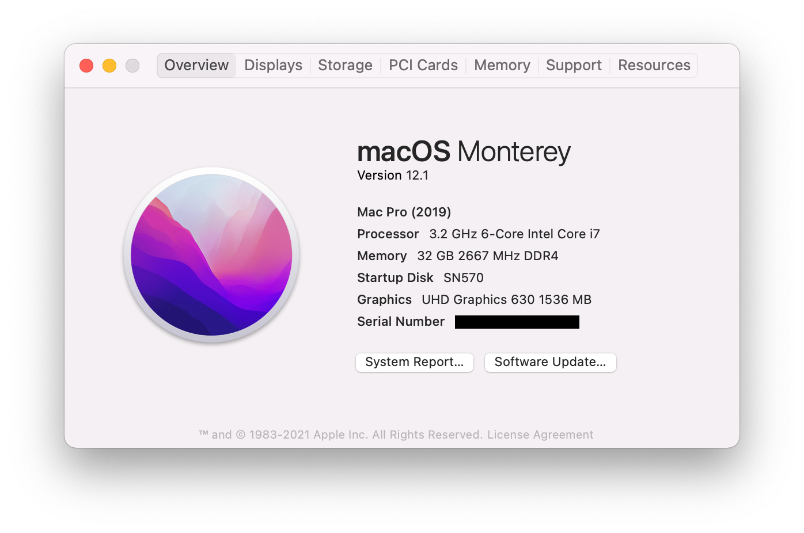

# Hackintosh-MSI-Z370M-MORTAR

This repository is about hackintosh on MSI Z370M MORTAR.

## Hardware

* Motherboard: MSI Z370M MORTAR 
    * Ethernet: Intel I219V2 PCI
    * Wi-Fi/BT: BCM94360CD(PCI-E Adapter)
    * Audio: *
* CPU: Intel i7-8700
* GPU: Intel UHD630 
* RAM: Crucial BALLISTIX DDR4 3200 32GB(16G×2)
* Display: AOC LV273HUPR (3840 x 2160 @ 60.00Hz)
* Hark Disk: WD Blue SN570 1TB SSD

## Software

* Bootloader: OpenCore 0.7.6
* OS: macOS Monterey 12.1 (Mac Pro)

## What's working

- [x] Intel UHD630 (iGPU)
- [x] Audio *
- [x] Intel I219V2 PCI Express Gigabit Ethernet
- [x] Wi-Fi/BT (BCM94360CD)
- [x] USB
- [x] Restart/Shutdown
- [x] Sleep/Wake
- [x] Power Management (Native support)
- [x] 4k HIDPI
